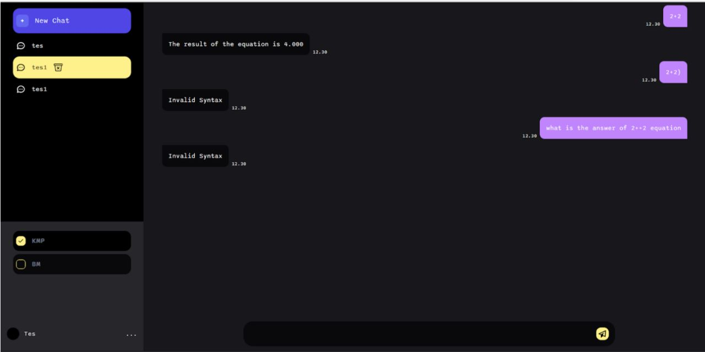

# Tubes3_13521054

Tugas Besar III IF2211 Strategi Algoritma Semester II Tahun 2022/2023
 
Penerapan String Matching dan Regular Expression dalam <i>Pembuatan ChatGPT Sederhana</i>

## Table of Contents

- [General Information](#general-information)
- [Program Display](#program-display)
- [How To Run](#how-to-run)
- [Tech Stack](#tech-stack)
- [Author](#author)

## General Information

TDalam dunia teknologi, chatbot telah menjadi hal yang umum digunakan dalam berbagai aplikasi dan platform seperti situs web, aplikasi mobile, dan media sosial. Chatbot memungkinkan pengguna untuk berinteraksi dengan program yang memiliki kemampuan untuk memproses dan merespons percakapan secara otomatis. Salah satu contoh chatbot yang sedang booming saat ini adalah ChatGPT. 

Pembangunan chatbot dapat dilakukan dengan menggunakan berbagai pendekatan dari bidang Question Answering (QA). Pendekatan QA yang paling sederhana adalah menyimpan sejumlah pasangan pertanyaan dan jawaban, menentukan pertanyaan yang paling mirip dengan pertanyaan yang diberikan pengguna, dan memberikan jawabannya kepada pengguna. Untuk mencocokkan input pengguna dengan pertanyaan yang disimpan pada database, kalian bisa menggunakan string matching.

String matching adalah teknik untuk mencocokkan suatu string atau pola dengan string lainnya, dengan tujuan untuk menentukan apakah kedua string tersebut cocok atau tidak. Teknik ini biasanya digunakan dalam chatbot untuk mengenali kata-kata atau frasa tertentu yang dapat dipahami oleh program dan digunakan sebagai input untuk menentukan respon yang sesuai. Sementara itu, regular expression adalah kumpulan aturan atau pola yang digunakan untuk pencocokan string dengan format yang spesifik. Teknik ini sering digunakan dalam chatbot untuk mengenali dan memproses input pengguna yang memiliki format tertentu, seperti nomor telepon, alamat email, atau kode pos. 

## Program Display

### Tampilan Awal Program

>Login Page

> Register Page

## How To Run

## Tech Stack

## Author

| NIM      | Name          | GitHub                                            |
| -------- | ------------- | ------------------------------------------------- |
| 13521054 | Wilson Tansil | [Tansil011019](https://github.com/Tansil011019)   |
| 135210065 | Mutawally Nawwar  | [mutawalle](https://github.com/mutawalle) |
| 13521122 | Ulung Adi Putra | [Ulung32](https://github.com/Ulung32) |
